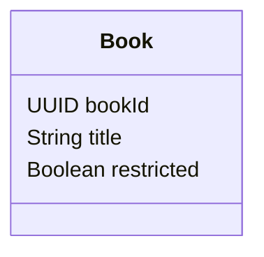
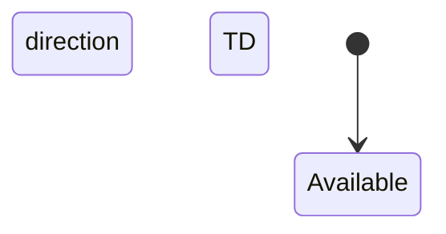
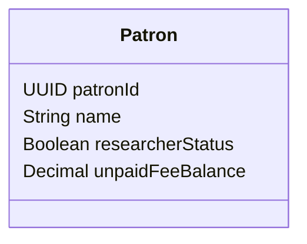
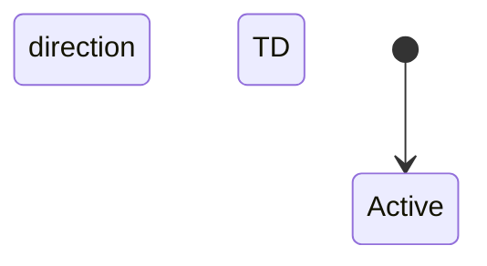
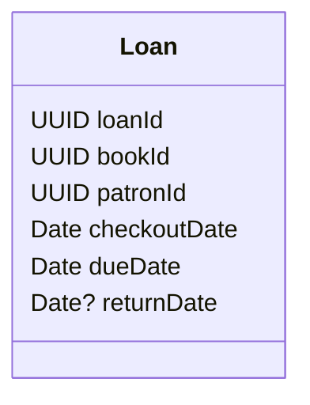
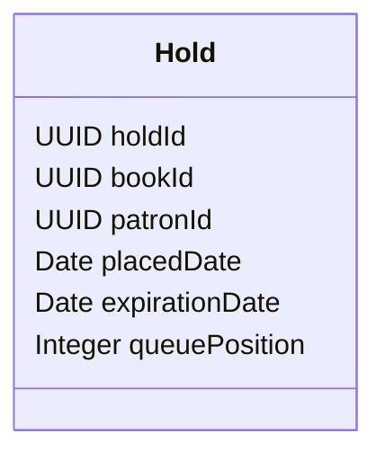
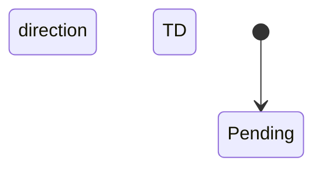
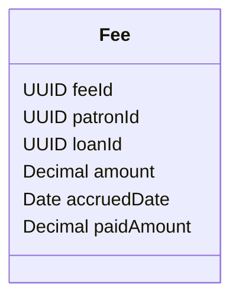
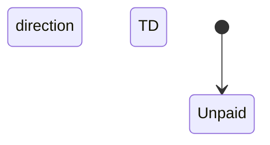

# Domain: PublicLibrary

## Domain Purity Score: 100/100

## Architecture Overview

```mermaid
graph TD
    classDef command fill:#2563eb,stroke:#1d4ed8,color:#fff,rx:5px,ry:5px;
    classDef event fill:#16a34a,stroke:#15803d,color:#fff,rx:5px,ry:5px;
    classDef rule fill:#f59e0b,stroke:#b45309,color:#fff,shape:hexagon;
    classDef rejected fill:#dc2626,stroke:#991b1b,color:#fff;
    classDef classBox fill:#4A90E2,stroke:#2E5C8A,stroke-width:2px,color:#fff,font-family:Arial;

    subgraph Book [Aggregate: Book]
        Ent_Book["<b>Book</b><br/>---<br/>bookId: UUID<br/>title: String<br/>restricted: Boolean<br/>"]:::classBox
        C_Book_RegisterBook["<b>RegisterBook</b><br/>---<br/>title: String<br/>restricted: Boolean<br/>"]:::command
        Ent_Book -->|executes| C_Book_RegisterBook
        C_Book_MarkBookAsRestricted["<b>MarkBookAsRestricted</b><br/>---<br/>bookId: UUID<br/>"]:::command
        Ent_Book -->|executes| C_Book_MarkBookAsRestricted
        E_Book_RestrictedBookMarked["<b>RestrictedBookMarked</b><br/>---<br/>bookId: UUID<br/>"]:::event
    end

    subgraph Patron [Aggregate: Patron]
        Ent_Patron["<b>Patron</b><br/>---<br/>patronId: UUID<br/>name: String<br/>researcherStatus: Boolean<br/>unpaidFeeBalance: Decimal<br/>"]:::classBox
        C_Patron_RegisterPatron["<b>RegisterPatron</b><br/>---<br/>name: String<br/>researcherStatus: Boolean<br/>"]:::command
        Ent_Patron -->|executes| C_Patron_RegisterPatron
        C_Patron_SuspendPatron["<b>SuspendPatron</b><br/>---<br/>patronId: UUID<br/>"]:::command
        Ent_Patron -->|executes| C_Patron_SuspendPatron
        C_Patron_RestorePatron["<b>RestorePatron</b><br/>---<br/>patronId: UUID<br/>"]:::command
        Ent_Patron -->|executes| C_Patron_RestorePatron
        E_Patron_PatronSuspended["<b>PatronSuspended</b><br/>---<br/>patronId: UUID<br/>unpaidFeeBalance: Decimal<br/>"]:::event
        E_Patron_PatronRestored["<b>PatronRestored</b><br/>---<br/>patronId: UUID<br/>"]:::event
    end

    subgraph Loan [Aggregate: Loan]
        Ent_Loan["<b>Loan</b><br/>---<br/>loanId: UUID<br/>bookId: UUID<br/>patronId: UUID<br/>checkoutDate: Date<br/>dueDate: Date<br/>returnDate: Date<br/>"]:::classBox
        C_Loan_CheckOutBook["<b>CheckOutBook</b><br/>---<br/>bookId: UUID<br/>patronId: UUID<br/>"]:::command
        Ent_Loan -->|executes| C_Loan_CheckOutBook
        C_Loan_MarkLoanOverdue["<b>MarkLoanOverdue</b><br/>---<br/>loanId: UUID<br/>"]:::command
        Ent_Loan -->|executes| C_Loan_MarkLoanOverdue
        C_Loan_ReturnBook["<b>ReturnBook</b><br/>---<br/>loanId: UUID<br/>"]:::command
        Ent_Loan -->|executes| C_Loan_ReturnBook
        C_Loan_ReturnOverdueBook["<b>ReturnOverdueBook</b><br/>---<br/>loanId: UUID<br/>"]:::command
        Ent_Loan -->|executes| C_Loan_ReturnOverdueBook
        E_Loan_BookCheckedOut["<b>BookCheckedOut</b><br/>---<br/>loanId: UUID<br/>bookId: UUID<br/>patronId: UUID<br/>"]:::event
        E_Loan_LoanMarkedOverdue["<b>LoanMarkedOverdue</b><br/>---<br/>loanId: UUID<br/>patronId: UUID<br/>"]:::event
        E_Loan_BookReturned["<b>BookReturned</b><br/>---<br/>loanId: UUID<br/>bookId: UUID<br/>"]:::event
    end

    subgraph Hold [Aggregate: Hold]
        Ent_Hold["<b>Hold</b><br/>---<br/>holdId: UUID<br/>bookId: UUID<br/>patronId: UUID<br/>placedDate: Date<br/>expirationDate: Date<br/>queuePosition: Integer<br/>"]:::classBox
        C_Hold_PlaceHold["<b>PlaceHold</b><br/>---<br/>bookId: UUID<br/>patronId: UUID<br/>"]:::command
        Ent_Hold -->|executes| C_Hold_PlaceHold
        C_Hold_ActivateHold["<b>ActivateHold</b><br/>---<br/>holdId: UUID<br/>"]:::command
        Ent_Hold -->|executes| C_Hold_ActivateHold
        C_Hold_ExpireHold["<b>ExpireHold</b><br/>---<br/>holdId: UUID<br/>"]:::command
        Ent_Hold -->|executes| C_Hold_ExpireHold
        C_Hold_FulfillHold["<b>FulfillHold</b><br/>---<br/>holdId: UUID<br/>"]:::command
        Ent_Hold -->|executes| C_Hold_FulfillHold
        E_Hold_HoldPlaced["<b>HoldPlaced</b><br/>---<br/>holdId: UUID<br/>bookId: UUID<br/>patronId: UUID<br/>"]:::event
        E_Hold_HoldActivated["<b>HoldActivated</b><br/>---<br/>holdId: UUID<br/>bookId: UUID<br/>"]:::event
        E_Hold_HoldExpired["<b>HoldExpired</b><br/>---<br/>holdId: UUID<br/>bookId: UUID<br/>"]:::event
        E_Hold_HoldFulfilled["<b>HoldFulfilled</b><br/>---<br/>holdId: UUID<br/>bookId: UUID<br/>patronId: UUID<br/>"]:::event
    end

    subgraph Fee [Aggregate: Fee]
        Ent_Fee["<b>Fee</b><br/>---<br/>feeId: UUID<br/>patronId: UUID<br/>loanId: UUID<br/>amount: Decimal<br/>accruedDate: Date<br/>paidAmount: Decimal<br/>"]:::classBox
        C_Fee_AccrueLateFee["<b>AccrueLateFee</b><br/>---<br/>loanId: UUID<br/>amount: Decimal<br/>"]:::command
        Ent_Fee -->|executes| C_Fee_AccrueLateFee
        C_Fee_MakePartialPayment["<b>MakePartialPayment</b><br/>---<br/>feeId: UUID<br/>amount: Decimal<br/>"]:::command
        Ent_Fee -->|executes| C_Fee_MakePartialPayment
        C_Fee_PayRemainingBalance["<b>PayRemainingBalance</b><br/>---<br/>feeId: UUID<br/>amount: Decimal<br/>"]:::command
        Ent_Fee -->|executes| C_Fee_PayRemainingBalance
        E_Fee_LateFeeAccrued["<b>LateFeeAccrued</b><br/>---<br/>feeId: UUID<br/>loanId: UUID<br/>amount: Decimal<br/>"]:::event
        E_Fee_FeePartiallyPaid["<b>FeePartiallyPaid</b><br/>---<br/>feeId: UUID<br/>amount: Decimal<br/>"]:::event
        E_Fee_FeePaid["<b>FeePaid</b><br/>---<br/>feeId: UUID<br/>amount: Decimal<br/>"]:::event
    end

```

## Aggregate: Book

### Structural View (Class Diagram)

### Behavioral View (State Diagram)

### Visual Contract

#### Commands
- **RegisterBook** ( → Available) — Actor: Librarian — Params: (title: String, restricted: Boolean)
- **MarkBookAsRestricted** (stateless - no state change) — Actor: Librarian — Params: (bookId: UUID)

#### Domain Events
- **RestrictedBookMarked** — Payload: (bookId: UUID)

---

## Aggregate: Patron

### Structural View (Class Diagram)

### Behavioral View (State Diagram)

### Visual Contract

#### Commands
- **RegisterPatron** ( → Active) — Actor: Librarian — Params: (name: String, researcherStatus: Boolean)
- **SuspendPatron** (Active → Suspended) — Actor: System — Params: (patronId: UUID)
- **RestorePatron** (Suspended → Active) — Actor: Librarian — Params: (patronId: UUID)

#### Domain Events
- **PatronSuspended** — Payload: (patronId: UUID, unpaidFeeBalance: Decimal)
- **PatronRestored** — Payload: (patronId: UUID)

---

## Aggregate: Loan

### Structural View (Class Diagram)

### Behavioral View (State Diagram)

### Visual Contract

#### Commands
- **CheckOutBook** ( → Active) — Actor: Patron — Params: (bookId: UUID, patronId: UUID)
- **MarkLoanOverdue** (Active → Overdue) — Actor: System — Params: (loanId: UUID)
- **ReturnBook** (Active → Returned) — Actor: Librarian — Params: (loanId: UUID)
- **ReturnOverdueBook** (Overdue → Returned) — Actor: Librarian — Params: (loanId: UUID)

#### Domain Events
- **BookCheckedOut** — Payload: (loanId: UUID, bookId: UUID, patronId: UUID)
- **LoanMarkedOverdue** — Payload: (loanId: UUID, patronId: UUID)
- **BookReturned** — Payload: (loanId: UUID, bookId: UUID)

---

## Aggregate: Hold

### Structural View (Class Diagram)

### Behavioral View (State Diagram)

### Visual Contract

#### Commands
- **PlaceHold** ( → Pending) — Actor: Patron — Params: (bookId: UUID, patronId: UUID)
- **ActivateHold** (Pending → ReadyForPickup) — Actor: System — Params: (holdId: UUID)
- **ExpireHold** (ReadyForPickup → Expired) — Actor: System — Params: (holdId: UUID)
- **FulfillHold** (ReadyForPickup → Fulfilled) — Actor: Librarian — Params: (holdId: UUID)

#### Domain Events
- **HoldPlaced** — Payload: (holdId: UUID, bookId: UUID, patronId: UUID)
- **HoldActivated** — Payload: (holdId: UUID, bookId: UUID)
- **HoldExpired** — Payload: (holdId: UUID, bookId: UUID)
- **HoldFulfilled** — Payload: (holdId: UUID, bookId: UUID, patronId: UUID)

---

## Aggregate: Fee

### Structural View (Class Diagram)

### Behavioral View (State Diagram)

### Visual Contract

#### Commands
- **AccrueLateFee** ( → Unpaid) — Actor: System — Params: (loanId: UUID, amount: Decimal)
- **MakePartialPayment** (Unpaid → PartiallyPaid) — Actor: Librarian — Params: (feeId: UUID, amount: Decimal)
- **PayRemainingBalance** (PartiallyPaid → Paid) — Actor: Librarian — Params: (feeId: UUID, amount: Decimal)

#### Domain Events
- **LateFeeAccrued** — Payload: (feeId: UUID, loanId: UUID, amount: Decimal)
- **FeePartiallyPaid** — Payload: (feeId: UUID, amount: Decimal)
- **FeePaid** — Payload: (feeId: UUID, amount: Decimal)

---

