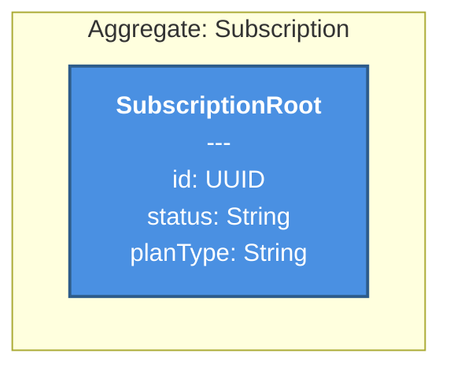
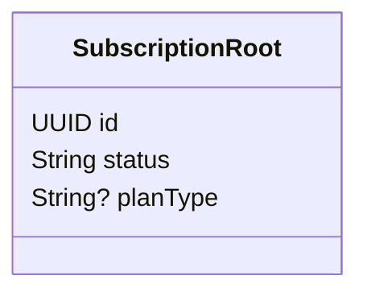
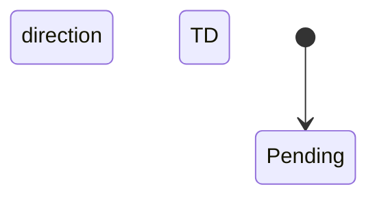

# Domain: Billing

# Domain: Billing

## Domain Purity Score: 100/100

## Architecture Overview

## Aggregate: Subscription

### Structural View (Class Diagram)

### Behavioral View (State Diagram)

### Visual Contract

---

